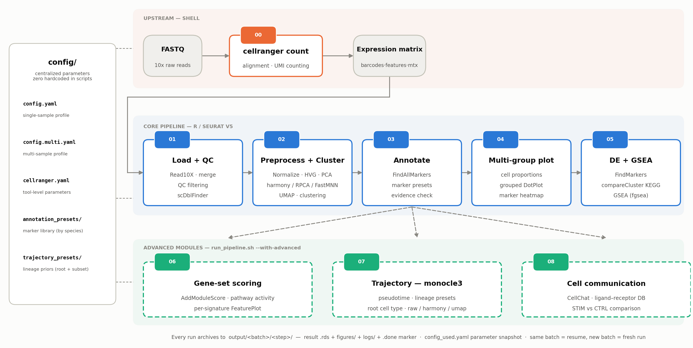
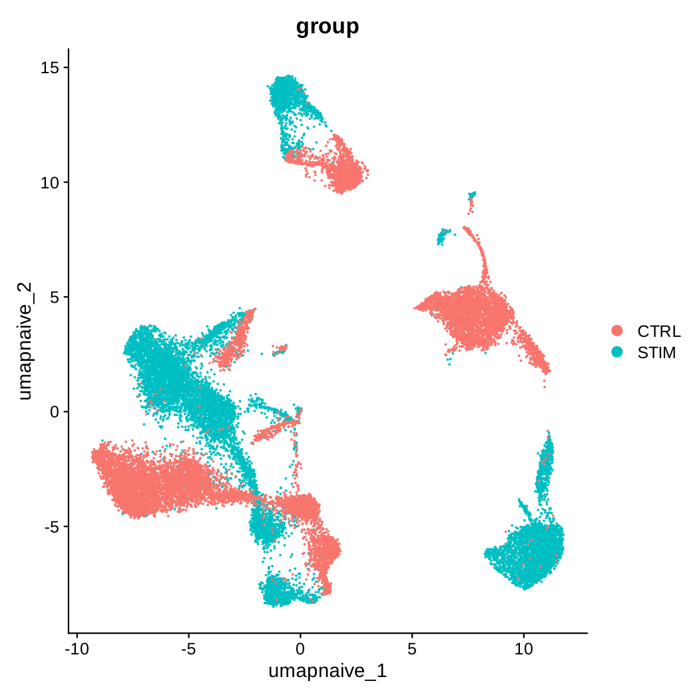
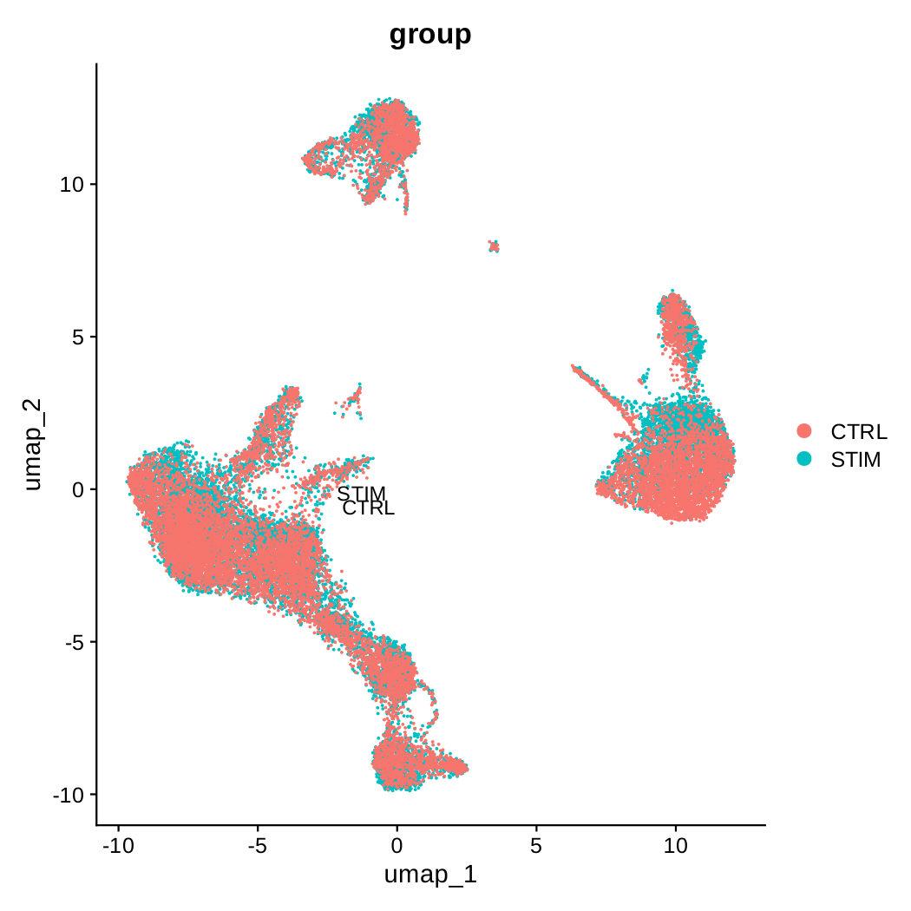
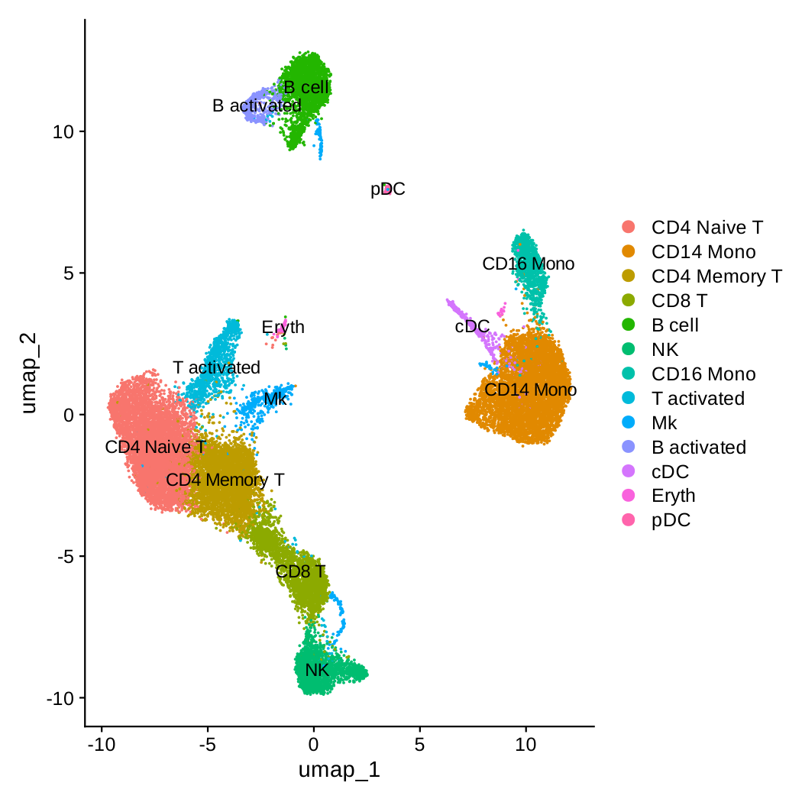
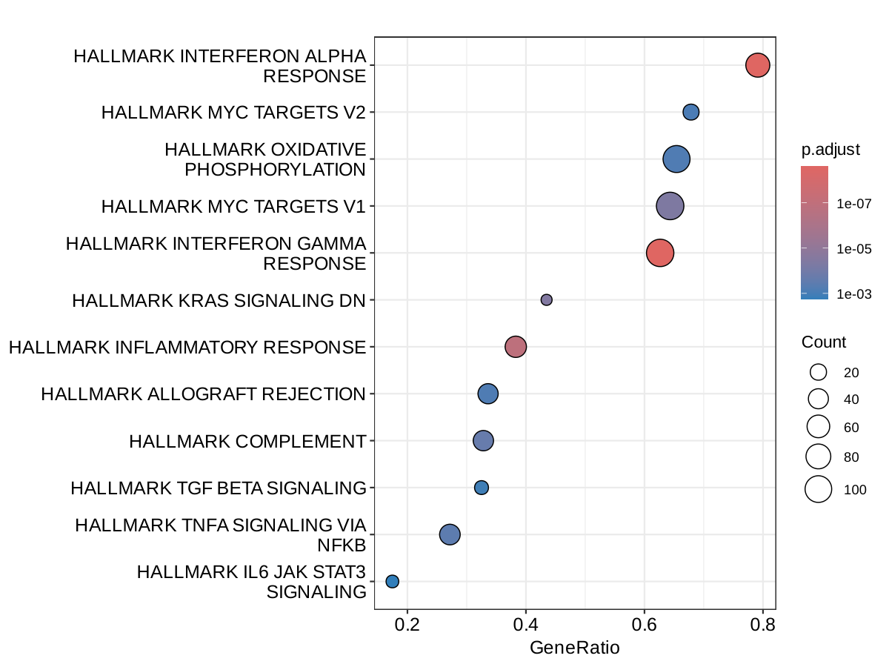
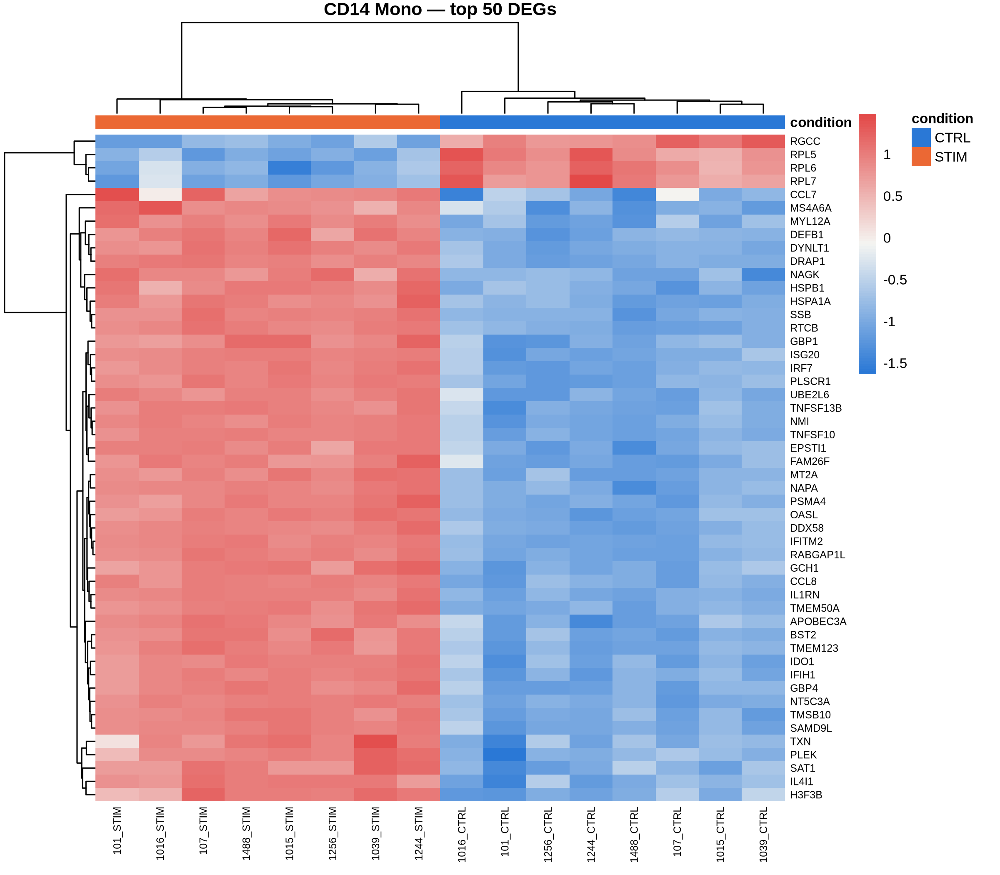
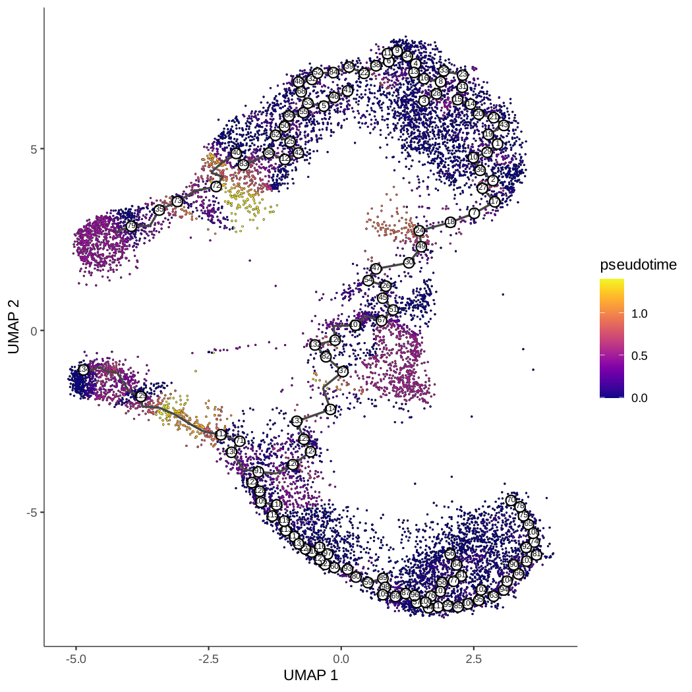

# scrna-seq-workflow

[English](README.md) | 简体中文

> 从上游定量到下游分析的 scRNA-seq 完整分析流程。
> 在没有真实项目数据的情况下，基于公开教程 + 10x 官方文档自学搭建，Seurat v5 适配。
> 架构参考 GitHub 主流 scRNA-seq 项目（每步一脚本 + 集中配置 + 顺序 runner，如 [hossainlab/sc-workflow](https://github.com/hossainlab/sc-workflow)；工业级工作流引擎 Snakemake/Nextflow 的对比见 docs/01）。

## 项目故事（怎么学出来的）

1. **跟教程学**：基于 Seurat v4 公开教程，从单样本基础分析到多样本整合分析，共 10 个教学脚本（原始学习轨迹保留在本机，未随本仓库上传）
2. **适配新版本**：教程基于 Seurat v4，实际环境是 Seurat v5 + Linux，逐行改写，v4/v5 差异的处理沉淀在各脚本注释与下方[关键踩坑记录](#关键踩坑记录)
3. **补齐上游**：教程从表达矩阵开始，自学补充了 cellranger 定量部分（已用 10x tiny 测试数据真实跑通全流程）
4. **扩展学习**：在主线之外自学了多种整合方法（RPCA/FastMNN/scVI/Liger）和基因集打分（AddModuleScore/UCell/AUCell）
5. **工程化整合**：调研 GitHub 主流项目结构后，把流程重构为**分阶段脚本 + config 集中配置 + 断点续跑 runner**（脚本粒度参考 [hossainlab/sc-workflow](https://github.com/hossainlab/sc-workflow)：按分析阶段打包，而非每个操作一个脚本）

## 目录结构

```
scrna-seq-workflow/
├── README.md                    # 英文版项目总览
├── README_CN.md                 # 中文版项目总览（本文件）
├── environment.yaml             # mamba 环境定义（一键重建 scrna 环境）
├── run_pipeline.sh              # 总控：顺序执行 + 断点续跑 + 每步日志
├── config/
│   ├── config.yaml              # 单样本流程配置（默认）
│   ├── config.multi.yaml        # 多样本流程配置（--mode multi 自动加载）
│   ├── sample_sheet.csv         # 多样本样本表（sample, group, fastqs, matrix）
│   ├── cellranger.yaml          # 上游定量工具级配置（与下游 R 解耦，跨项目复用）
│   ├── trajectory_presets/      # 07 拟时序谱系预设（root + 细胞子集 + 文献依据）
│   └── annotation_presets/      # 03 注释 marker 预设库（物种文件夹 + 别名 + 出处）
├── bash/                        # 上游 shell 脚本（cellranger 是 shell 工具，语言无关）
│   └── 00_run_cellranger.sh     # cellranger count 批量定量（读 config + 样本表）
├── R/                           # R 流程脚本（分阶段，每阶段可单独重跑/投递节点）
│   ├── 01_load_qc.R             # 读入 + 质控（单/多样本按 config 自动分支）
│   ├── 02_preprocess_cluster.R  # 预处理 + 去批次 + UMAP + 聚类
│   ├── 03_annotate.R            # 细胞注释 + 亚群细分（config 开关）
│   ├── 04_multi_group_plot.R    # 多组可视化
│   ├── 05_diff_gsea.R           # 探索性差异分析 + GSEA（细胞为统计单元）
│   ├── 06_pseudobulk_de.R       # 确认性差异分析：pseudobulk + DESeq2（sample-aware）
│   ├── 07_gene_set_score.R      # 高级：基因集打分
│   ├── 08_trajectory_analysis.R # 高级：拟时序（monocle3）
│   └── 09_cell_communication.R  # 高级：细胞通讯（CellChat）
├── Python/                      # Python 流程（规划中：scanpy 平行版本，见 Python/README.md）
├── docs/                        # 流程文档 / cellranger 指南 / R 包编译踩坑
├── utils/                       # 共享工具：utils.R（配置/归档/质控/预处理/聚类）
│                                #          + save_fig.R（图片保存，cairo_pdf 支持中文）
├── data/                        # 数据分层管理（软链接/大文件，不入 git）：
│   ├── raw/                     #   原始 FASTQ（只读，cellranger 输入）
│   ├── matrices/                #   公开数据集/已定量矩阵（PBMC3k、GSE96583）
│   └── reference/               #   参考数据：
│       ├── refdata/             #     cellranger 参考基因组（tiny 演示参考已就位）
│       └── gene_sets/           #     MSigDB 基因集 gmt
└── output/<batch>/              # 每个批次完全自包含（不入 git）：
                                 #   各步骤结果 rds + figures/ + logs/（每步日志）
                                 #   + config_used.yaml（本批次参数快照，可追溯）
```

## 分析流程总览



<!-- vector version + generator script: docs/assets/pipeline_overview.svg · docs/assets/make_pipeline_figure.py -->

## 结果展示

run04 验证批次的真实输出（GSE96583，质控后 24,644 细胞）。

**多样本整合 —— harmony 前后对比**

| 整合前 | 整合后 |
|---|---|
|  |  |

校正前 STIM 与 CTRL 在共同的细胞群内明显分离；harmony 校正后两组的对应细胞类型对齐，支持跨组比较。

**细胞类型注释（13 类）**



「分群编号 → 细胞类型」映射经 marker 证据机器校验（03 的 `check_mapping_evidence()`），聚类编号重排不会悄悄贴错标签。

**GSEA —— IFN-β 刺激响应（CD14 单核细胞，STIM vs CTRL）**



Hallmark GSEA 中干扰素-α 响应位居激活通路第一（GeneRatio ≈ 0.8），干扰素-γ 响应也显著富集——与 GSE96583 的 IFN-β 刺激设计一致。

**Pseudobulk DE —— 样本级确认（CD14 单核细胞，DESeq2）**



Top 50 显著 DEG 热图（vst 标准化值），样本按条件聚类成两簇——06 把同类细胞按供者聚合成 pseudobulk，DESeq2 把供者作统计单元，解决 05 的伪重复问题。

**拟时序 —— T 细胞谱系（monocle3）**



T 谱系子集上的伪时间（12,828 细胞，根 = CD4 Naive T，谱系预设来自 `config/trajectory_presets/`）；Inf 伪时间 = 0——只对连通谱系跑轨迹，避开图不连通的 Inf 问题。

## 技术亮点

- **样本级统计**：Pseudobulk + DESeq2 配对设计，解决伪重复问题（步骤 06）
- **防御式设计**：机器校验的分群映射、固定种子、断点续跑编排
- **工程实践**：集中配置、分步日志、参数快照、188 行踩坑表

## 快速开始

```bash
# 1. 激活环境（首次使用先 mamba env create -f environment.yaml 重建）
mamba activate scrna        # R 4.5.3 + Seurat 5.5.1 + presto 加速

# 2. 上游定量（从 FASTQ 开始；需要先下载参考基因组并填写样本表 fastqs 列）
bash bash/00_run_cellranger.sh
#    工具级参数: config/cellranger.yaml（参考基因组/硬件资源）
#    参考基因组下载与 FASTQ 组织: 见 docs/02_cellranger_guide.md（参考 ~11GB）
#    ⚠️ 没有 FASTQ 时跳过此步——示例数据自带现成矩阵（见下方「示例数据」），流程直接从第 3 步开始

# 3. 单样本流程（PBMC3k 示例，默认配置 config/config.yaml）
bash run_pipeline.sh

# 4. 多样本流程（STIM/CTRL，自动加载 config/config.multi.yaml）
bash run_pipeline.sh --mode multi

# 5. 追加高级模块
bash run_pipeline.sh --mode multi --with-advanced

# 6. 灵活执行（同批次断点续跑：已有产物的步骤自动跳过）
bash run_pipeline.sh --only 02            # 只重跑预处理+聚类（改 resolution 后常用）
bash run_pipeline.sh --from 02 --to 03    # 跑 02~03
bash run_pipeline.sh --force              # 当前批次全部强制重跑
Rscript R/02_preprocess_cluster.R   # 单阶段直接运行（HPC 节点上单独投递）

# 7. 批次管理（config 里 batch 字段）：每次运行的结果与日志按批次归档
#    同批次名重跑 = 断点续跑；换批次名（如 batch: run02）= 全新运行，旧批次结果保留
#    每个批次自动保存 config_used.yaml 参数快照，便于对比追溯
#    output/run01/（结果 + logs/ + config_used.yaml）← 一个完整批次
```

### 示例数据

| 数据集 | 来源 | 用途 |
|---|---|---|
| PBMC 3k（hg19 三件套） | 10x 官网 | 单样本流程 |
| STIM/CTRL 表达矩阵 | GSE96583（IFN-β 刺激 PBMC） | 多样本整合 + 差异 + GSEA + pseudobulk 差异 |
| pbmc_1k_v3 FASTQ + GRCh38-2024-A 参考基因组 | 10x 官网 | cellranger 真实数据练习 |

下载位置与目录组织：见 [docs/01_pipeline_overview.md](docs/01_pipeline_overview.md) 末尾的数据来源一节。
注意：GSE96583 的 GEO 提交矩阵被过滤掉了线粒体基因，该数据集的 `percent.mt` 退化为 0（真实 cellranger 输出不受影响）。

### 样本表（多样本模式）

`config/sample_sheet.csv` 是把自有数据接进多样本流程的入口——下游所有比较都从它出发：

| 列 | 消费方 | 作用 |
|---|---|---|
| `sample` | 01（orig.ident）、06 默认 `sample_id` | 样本名 = pseudobulk 差异的生物学重复单位 |
| `group` | 02 整合、04 多组图、05 差异+GSEA、06 的 `condition_col` | **所有下游比较的分组单位**，取值须与 config 的 `pseudobulk$test_group` / `reference_group` 完全一致 |
| `fastqs` | 00 cellranger | 上游定量输入（与 `matrix` 二选一） |
| `matrix` | 01 | 10x 矩阵目录/h5（与 `fastqs` 二选一） |

两点提醒：

- `group` 写错**不会报错**，只会静默跑出错误的对比。换数据集后先核对它与 config 的 `test_group`/`reference_group` 一致性
- 合并矩阵场景（每行是多供者池，如 GSE96583），`sample` 列不再代表生物学重复——配置 `multi$cell_metadata`，01 会按 (group, barcode) join 供者写入 `sample_id`

## 输出产物

每次运行归档在 `output/<batch>/<step>/` —— 结果 `.rds` + `figures/` + `.done` 断点标记；每个批次还保留各步 `logs/` 与 `config_used.yaml` 参数快照。各步骤产出如下（run04 验证批次的真实文件清单）：

| 步骤 | 关键结果 | 代表性图片 |
|---|---|---|
| 00 cellranger | `<sample>/outs/` 过滤矩阵 + `web_summary.html` 质检报告 | — |
| 01 读入 + 质控 | `seurat_qc.rds` | `qc_violin_before` |
| 02 预处理 + 聚类 | `seurat_clustered.rds` | `dimplot_clusters`, `umap_before_integration`, `dimplot_by_group_harmony`, `elbow` |
| 03 注释（+ 亚群细分） | `seurat_annotated.rds`, `all_markers_table.rds`, `top10_markers.csv`, `annotation_evidence.csv` | `dimplot_annotated`, `dotplot_markers_by_cluster`, `featureplot_celltypes/` |
| 04 多组可视化 | 仅图片 | `barplot_cell_proportion`, `dotplot_grouped`, `heatmap_top5_markers` |
| 05 差异 + GSEA | `split_markers.rds`, `diff_stim_vs_ctrl.rds` | `compareCluster_dotplot`, `gsea_kegg_dotplot`, `gsea_hallmark_dotplot` |
| 06 pseudobulk 差异 | `summary_degs.csv`，`by_celltype/<type>/`（`deseq2_results.tsv` + `significant_degs.tsv`） | `figures/<type>/`（`volcano`/`MAplot`/`PCA`/`heatmap`），顶层 `summary_05_vs_06` |
| 07 基因集打分 | `seurat_scored.rds` | `featureplot_<pathway>`（每条通路一张） |
| 08 拟时序 | `trajectory_cds.rds`, `trajectory_resolved.yaml`（参数快照） | `trajectory_pseudotime`, `trajectory_celltype`, `trajectory_by_group` |
| 09 细胞通讯 | `cellchat.rds`（单样本）/ `cellchat_list.rds`（多样本） | `compare_interaction_counts`, `diff_network_all`, `ranknet_pathway_comparison` |

## 关键踩坑记录

| 坑 | 原因 | 解决 |
|----|------|------|
| merge 后 `FindAllMarkers` 报错 | Seurat v5 merge 产生 split layers | `JoinLayers()` |
| 加载 v4 格式 rds 后 `JoinLayers` 报错 | v4 对象 Assay 类是 "Assay" | `scobj[["RNA"]] <- as(scobj[["RNA"]], "Assay5")` |
| cellranger 9 报缺 `--create-bam` | Cell Ranger 9 起该参数必填 | 显式指定 `--create-bam=false` |
| scale.data 体积爆炸 | 全基因缩放 = 基因数×细胞数稠密矩阵 | 默认只缩放高变基因；保存前清空 |
| top marker 不含经典 marker | v5 logFC 公式变化，低表达基因 logFC 虚高 | `annotate$marker_pct` 预筛选后再排序（默认 0.5） |
| GSEA 结果不可复现 | GSEA 用随机置换算 p 值 | `set.seed(123)` |
| 单样本/多样本注释映射混用 | 不同数据集分群数和细胞类型不同 | 配置 profile 分离：config.yaml / config.multi.yaml |
| 重跑后 cluster_map 贴错群（如 CD14 Mono 与 naive T 互换） | 聚类编号是 Louvain 社群发现顺序（任意标签），上游脚本/参数/环境一改，编号整体重排而群本身不变（2026-08-21 run02 事故） | ① 03 的 `check_mapping_evidence()` 机器校验：贴错群会 warning + 证据表 `annotation_evidence.csv` ② 聚类链路已固定种子（`cluster_cells()` 内 set.seed + `random.seed=42`），同输入必同编号 ③ 验证性重跑换 batch 名保留旧批次对照 |
| irlba 段错误（monocle3 `preprocess_cds`；2026-09-01 环境刷新后 02 的 `RunPCA` 也触发） | irlba + OpenBLAS 多线程竞态（实测 r-irlba 2.3.7 + OpenBLAS 0.3.33） | run_pipeline.sh 对所有 R 步骤统一 `OPENBLAS_NUM_THREADS=1`（R 内 `Sys.setenv` 无效，必须 shell 层） |
| `order_cells` 报 "root_pr_nodes or root_cells must be provided" | Rscript 非交互模式无法弹窗选根（RStudio 交互才会弹） | 谱系预设显式指定根（config/trajectory_presets/） |
| 全细胞混跑轨迹 30% 细胞伪时间 Inf | 异构细胞类型间不存在连续轨迹，图不连通 | 谱系预设子集（如仅 T 细胞），run02 验证 Inf=0 |
| FeaturePlot 与 DimPlot 布局不一致 | `umap_naive` 抢占默认降维（DefaultDimReduc 按名匹配），FeaturePlot 不显式指定时画在校正前的图上 | 所有 FeaturePlot 显式 `reduction = "umap"` |
| 组间"显著 DEG"数量虚高（STIM vs CTRL 动辄上千个） | `FindAllMarkers`/`FindMarkers` 把每个细胞当独立观测，而同一供者的细胞彼此相关——伪重复（GSE96583 是 8 供者配对数据） | 用 `06_pseudobulk_de.R` 确认：原始 counts 按 供者×细胞类型 聚合，DESeq2 把供者作 blocking 因子；同阈值对照落在 `summary_degs.csv` |

## 仓库范围与数据获取

- 仓库只提交**代码和文档**（`R/`、`bash/`、`Python/`、`utils/`、`config/`、`docs/`、`run_pipeline.sh`、`environment.yaml`、`LICENSE`、README 两个语言版本）
- 数据和结果（`data/`、`output/`、软链接）已写入 `.gitignore`
- 数据来源与获取方式见 [docs/01_pipeline_overview.md](docs/01_pipeline_overview.md) 末尾

## 环境

- 完整依赖清单见 [environment.yaml](environment.yaml)，一条命令重建环境：
  `mamba env create -f environment.yaml`
- 核心版本：R 4.5.3、Seurat 5.5.1、SeuratObject 5.4.0、monocle3 1.4.27、harmony、scDblFinder、DESeq2、apeglm、yaml
- ⚠️ 4 个包需从 GitHub 安装（conda 渠道无，见 yaml 头部注释）：SeuratWrappers、CellChat（必需）+ presto、scCustomize（可选）
- cellranger 9.0.1（独立软件，非 R 包，见 docs/02_cellranger_guide.md）

### 高级模块依赖（跑 08/09 前检查）

```bash
# 08 拟时序：monocle3 已安装并全量验证（run02 批次，T 细胞谱系预设）
#   安装：mamba install -c conda-forge -c bioconda r-monocle3
#   注意：运行需单线程 BLAS（run_pipeline.sh 已自动处理，见踩坑表）

# 09 细胞通讯：CellChat 2.2.0.9001 已安装（GitHub 源码编译；CRAN 已下架）
#   安装方式（备查）：devtools::install_github("jinworks/CellChat")
#   编译要点见 docs/03_r_package_compile.md（conda 环境 + R 4.5 头文件）
```

## 参考与致谢

- [hossainlab/sc-workflow](https://github.com/hossainlab/sc-workflow) —— 架构参考：脚本粒度（按分析阶段打包）+ 顺序 runner
- [Seurat PBMC 3k 教程](https://satijalab.org/seurat/articles/pbmc3k_tutorial.html) —— 学习路线的起点（v4）；[v5 官方文档](https://satijalab.org/seurat/) 为迁移参考
- 核心工具：[Seurat](https://github.com/satijalab/seurat) · [harmony](https://github.com/immunogenomics/harmony) · [monocle3](https://github.com/cole-trapnell-lab/monocle3) · [CellChat](https://github.com/jinworks/CellChat)

## 许可证

MIT —— 见 [LICENSE](LICENSE)。本项目仅供学习与研究使用。
